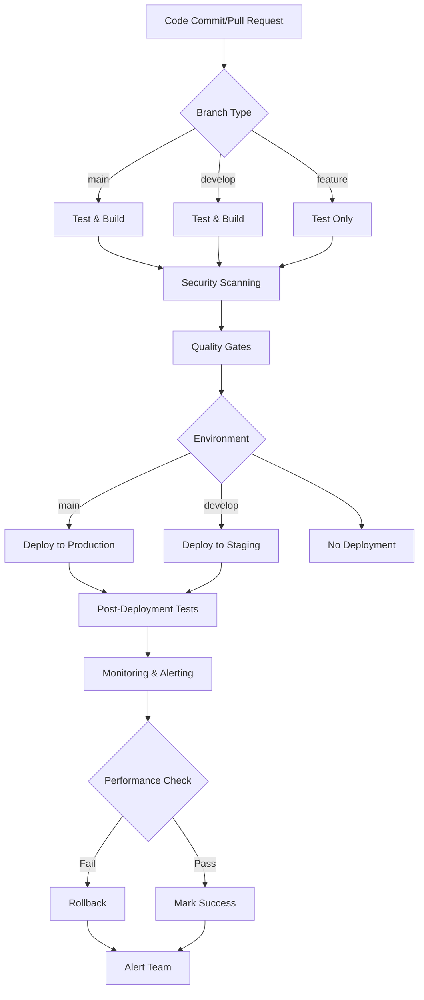

# Comprehensive CI/CD Strategy for AI Agent with Meta-Cognition

## Overview

This document outlines the comprehensive CI/CD strategy for the AI Agent with Meta-Cognition project. The strategy focuses on automated testing, building, and deployment with security scanning, monitoring, and quality gates.

## CI/CD Pipeline Architecture

## 1. Automated Testing Pipeline

### 1.1 Unit Tests
- Run on every commit and pull request
- Target: 80%+ code coverage
- Parallel execution for faster feedback
- Results published to test reporting dashboard

### 1.2 Integration Tests
- Test component interactions
- Run against test database and cache instances
- Validate API endpoints and data flows
- Include database integration tests

### 1.3 Performance Tests
- Load testing with realistic user scenarios
- Response time validation (target: < 2s average)
- Memory usage monitoring
- Stress testing for concurrent users

### 1.4 Security Tests
- Static code analysis with bandit
- Dependency vulnerability scanning
- Container security scanning
- Secrets detection

## 2. Build Pipeline

### 2.1 Multi-Stage Docker Builds
- Builder stage: Compile dependencies
- Runtime stage: Minimal production image
- Development stage: Extended tools for debugging

### 2.2 Environment-Specific Builds
- Development: Include debugging tools
- Staging: Match production as closely as possible
- Production: Optimized for performance and security

### 2.3 Build Artifacts
- Docker images with semantic versioning
- SBOM (Software Bill of Materials) generation
- Build provenance attestation
- Artifact signing

## 3. Deployment Strategy

### 3.1 Development Environment
- Automated deployment on every commit to develop branch
- Blue-green deployment pattern
- Automatic cleanup of old versions after 7 days

### 3.2 Staging Environment
- Deploy after successful development tests
- Manual approval for complex changes
- Automated smoke tests post-deployment
- Performance validation

### 3.3 Production Environment
- Manual approval required
- Canary deployment (10% -> 50% -> 100%)
- Rollback capability within 5 minutes
- Zero-downtime deployments

## 4. Monitoring and Alerting

### 4.1 Pipeline Monitoring
- Failed build alerts (Slack/email)
- Performance degradation alerts
- Security vulnerability alerts
- Deployment failure notifications

### 4.2 Application Monitoring
- Health check endpoints
- Performance metrics collection
- Error rate monitoring
- Resource utilization tracking

## 5. Security and Quality Gates

### 5.1 Security Gates
- No critical vulnerabilities allowed
- Container scan must pass
- Dependency audit required
- Secrets detection in code

### 5.2 Quality Gates
- Code coverage > 80%
- No high-severity linting issues
- Performance benchmarks met
- All tests passing

## 6. Infrastructure Requirements

### 6.1 CI/CD Infrastructure
- GitHub Actions for workflow orchestration
- Self-hosted runners for sensitive operations
- Artifact storage for build artifacts
- Container registry for Docker images

### 6.2 Deployment Infrastructure
- Kubernetes cluster for orchestration
- Monitoring stack (Prometheus, Grafana)
- Logging infrastructure (ELK or similar)
- Load balancer with SSL termination

## 7. Environment Configuration

### 7.1 Development
- Feature flags enabled
- Detailed logging
- Debug endpoints accessible
- Lower resource limits

### 7.2 Staging
- Production-like configuration
- Performance monitoring enabled
- Synthetic transaction monitoring
- Limited access control

### 7.3 Production
- Optimized resource allocation
- Full security controls
- Comprehensive monitoring
- Backup and disaster recovery

## 8. Rollback Strategy

### 8.1 Automated Rollback
- Triggered by health checks failure
- Performance degradation detection
- Error rate threshold exceeded

### 8.2 Manual Rollback
- Emergency procedures documented
- Quick rollback commands available
- Database migration rollback capability

## 9. Release Process

### 9.1 Versioning Strategy
- Semantic versioning (MAJOR.MINOR.PATCH)
- Git tags for releases
- Automated changelog generation
- Pre-release testing for major versions

### 9.2 Release Gates
- All automated tests passed
- Security scan completed
- Performance benchmarks met
- Manual QA sign-off for major features

## 10. Compliance and Audit

### 10.1 Audit Trail
- Complete build and deployment logs
- Artifact provenance tracking
- Change approval tracking
- Security scan results retention

### 10.2 Documentation
- Deployment runbooks
- Incident response procedures
- Configuration management
- Disaster recovery plans

## Implementation Roadmap

### Phase 1: Foundation (Week 1-2)
- [ ] Enhanced testing pipeline
- [ ] Security scanning integration
- [ ] Quality gates implementation

### Phase 2: Deployment (Week 3-4)
- [ ] Multi-environment deployment
- [ ] Monitoring setup
- [ ] Rollback mechanisms

### Phase 3: Optimization (Week 5-6)
- [ ] Performance testing integration
- [ ] Advanced deployment strategies
- [ ] Documentation completion